# 《TIMEMIXER: DECOMPOSABLE MULTISCALE MIXING FOR TIME SERIES FORECASTING》MindSpore实现

## 论文背景
时间序列预测广泛应用于许多领域，如交通规划和天气预报等。然而，由于现实世界的时间序列通常存在复杂的时间变化，使得预测任务极具挑战性。传统上，主流的时间序列分析方法主要包括简单分解和多周期性分析。然而，这些方法在处理复杂的时间变动方面仍存在局限性。现实世界中的时间序列通常表现出复杂且非平稳的特性，比如上升、下降和波动等多种变化深度混合在一起，对预测任务带来了巨大挑战。同时，时间序列在不同的采样尺度上表现出不同的特征。例如，按小时记录的交通流量在一天中表现出不同的变化，而按天采样的序列中，这些细粒度的变化消失了，只出现与节假日相关的波动。因此，不同尺度的时间序列包含不同的微观和宏观信息，这使得时序预测更加具有挑战性。

为了应对上述挑战，该论文提出了TimeMixer模型，通过引入全新的多尺度混合视角来分析和预测时间序列。TimeMixer模型包含两个核心模块：过去分解混合(PDM)和未来多预测器混合(FMM)，旨在充分利用多尺度时间序列中解缠结的季节性和趋势信息，从而提高长短期预测任务的精度和效率。

##  论文创新
- 提出了一个全新的多尺度混合视角来分析时间序列中的复杂变化，利用多个尺度的分离变化和互补的预测能力。
- 开发了一个名为 TimeMixer 的全部基于 MLP 架构的预测模型，该模型包括过去可分解混合 (PDM) 和未来多预测器混合 (FMM) 模块。
  - **PDM 模块**：对多尺度时间序列进行分解并分别在细尺度到粗尺度和粗尺度到细尺度方向上混合分解后的季节性和趋势成分，以此聚合微观季节信息和宏观趋势信息。
  - **FMM 模块**：结合多个预测器，从多尺度观察中利用互补的预测能力进行未来预测。
3. TimeMixer 在长期和短期的预测任务中都能够实现一致的最先进性能，同时表现出优越的运行时效率。

## 模型架构
### 整体架构
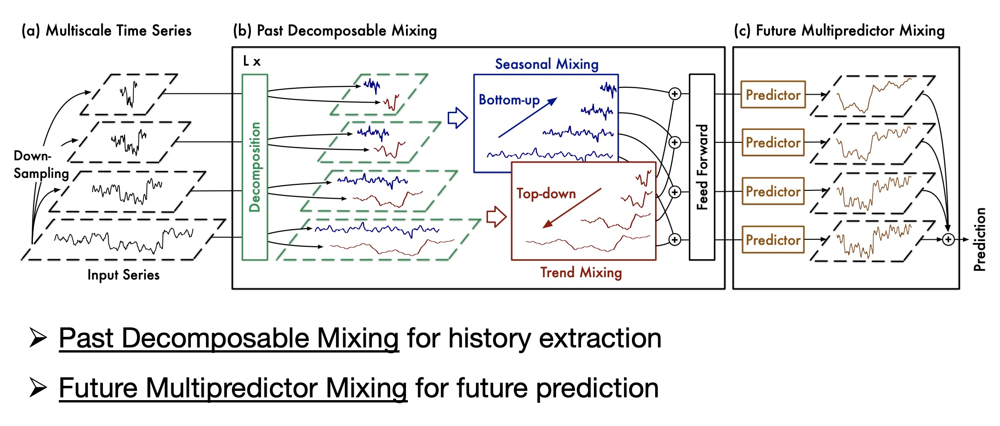
### PDM模块
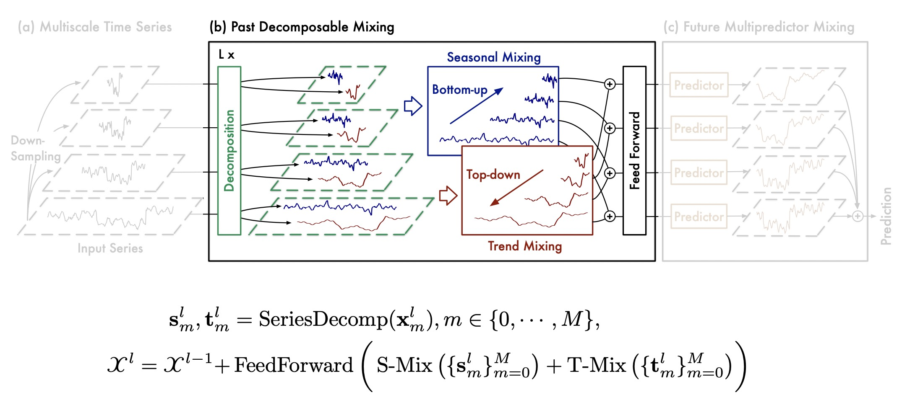
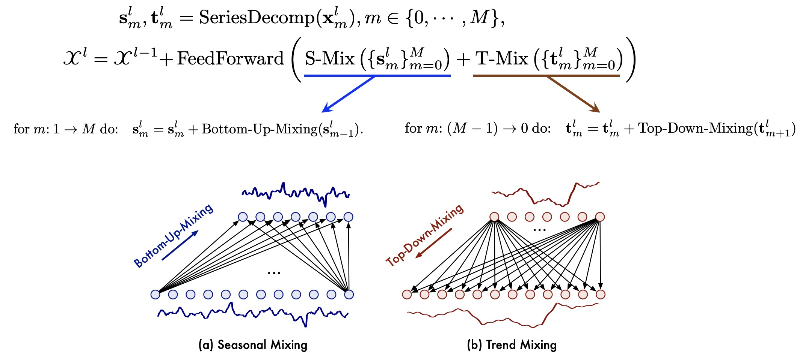
### FMM模块
未来多预测器混合（FMM）是由多个预测器组成的集成系统，其中不同的预测器基于不同尺度的过去信息，使FMM能够整合混合多尺度系列的互补预测能力。
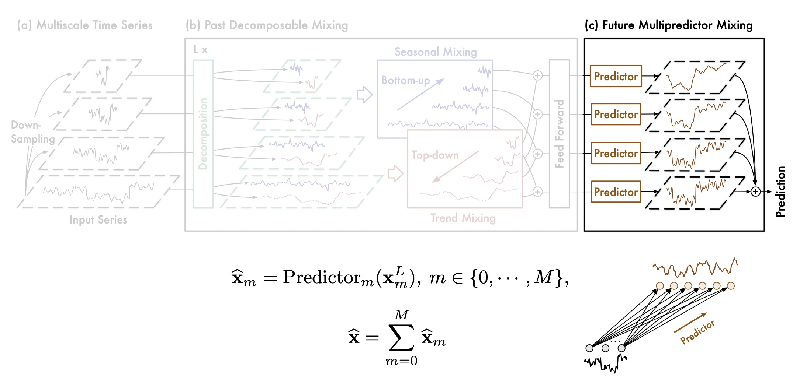

## MindSpore实现
### 环境准备
本实验中，我们使用docker在本地直接部署mindspore==2.2.14版本的开发环境。

**1.下载docker镜像**
```bash
docker pull swr.cn-south-1.myhuaweicloud.com/mindspore/mindspore-gpu-cuda11.6:2.2.14
```

**2.建立容器**
```bash
docker run --gpus all --privileged -d -it -v /home/samri/Documents/TimeMixer:/workspace/TimeMixer --shm-size 20g --name=timemixer swr.cn-south-1.myhuaweicloud.com/mindspore/mindspore-gpu-cuda11.6:2.2.14
```

**3.验证环境安装成功**
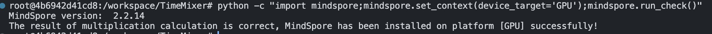

### 代码迁移
为高效率迁移模型及代码，此处使用MindSpore生态适配工具——[MindTorch](https://mindtorch.readthedocs.io/zh-cn/latest/index.html)。该工具能帮助用户高效使用昇腾算力，且在不改变原有PyTorch用户使用习惯的前提下，将代码快速迁移到MindSpore生态上。

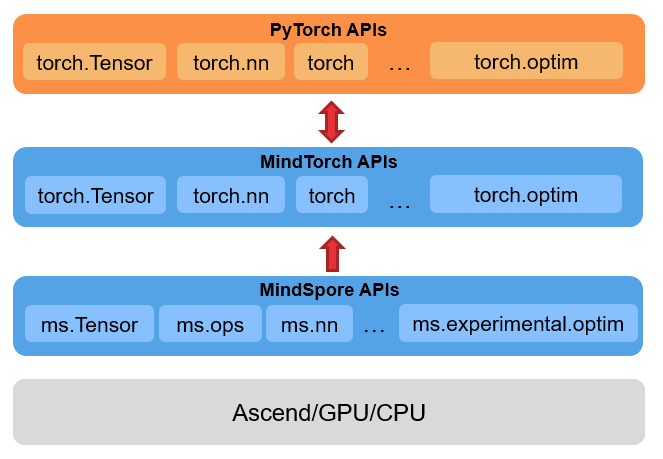

根据安装的2.2.14版本的MindSpore，选择安装0.2版本的MindTorch。
```
pip install mindtorch==0.2
```

使用以下脚本完成项目内所有torch相关包的替换
```bash
echo "Current Replacement Directory:${1:-./}"

find $1 -name "*.py" -print0 | xargs -0 sed -E -i "s/import\s+torchvision\.\b(.*\s+as\s.*)/import mindtorch.torchvision.\1/g"
find $1 -name "*.py" -print0 | xargs -0 sed -E -i "s/import\s+torchvision\b(.*\s+as\s.*)/import mindtorch.torchvision\1/g"
find $1 -name "*.py" -print0 | xargs -0 sed -E -i "s/import\s+torchvision\.\b.*/import mindtorch.torchvision as torchvision/g"
find $1 -name "*.py" -print0 | xargs -0 sed -E -i "s/import\s+torchvision\b/import mindtorch.torchvision as torchvision/g"
find $1 -name "*.py" -print0 | xargs -0 sed -E -i "s/from\s+torchvision\b/from mindtorch.torchvision/g"
find $1 -name "*.py" -print0 | xargs -0 sed -E -i "s/import\s+torch\.\b(.*\s+as\s.*)/import mindtorch.torch.\1/g"
find $1 -name "*.py" -print0 | xargs -0 sed -E -i "s/import\s+torch\b(.*\s+as\s.*)/import mindtorch.torch\1/g"
find $1 -name "*.py" -print0 | xargs -0 sed -E -i "s/import\s+torch\.\b.*/import mindtorch.torch as torch/g"
find $1 -name "*.py" -print0 | xargs -0 sed -E -i "s/import\s+torch\b/import mindtorch.torch as torch/g"
find $1 -name "*.py" -print0 | xargs -0 sed -E -i "s/from\s+torch\b/from mindtorch.torch/g"

echo "Replacement torch/torchvision completed!"
```

### 手动调整代码
由于MindSpore的自动微分采用函数式表达，和PyTorch的微分接口存在差异,因此需要手动调整反向传播部分的代码，将PyTorch版本的训练流程代码转换为MindSpore的函数式编程写法，从而使能MindSpore动静统一、自动并行等竞争力功能。需要调整的文件分别为`exp/exp_long_term_forecasting.py`和`exp/exp_short_term_forecasting.py`，具体步骤如下：

- 删除原始优化器的.zero_grad()和损失反向传播的.backward()函数部分。MindSpore不需要调用loss.backward()以及optimizer.zero_grad()。
- 将前向过程进行包装

```python
def forward(batch_x, batch_x_mark, batch_y, batch_y_mark, dec_inp):
    outputs = self.model(batch_x, batch_x_mark, dec_inp, batch_y_mark)
    if self.args.output_attention:
        outputs = outputs[0]
    f_dim = -1 if self.args.features == 'MS' else 0
    batch_y, outputs = self.__process_outputs(batch_y, f_dim, outputs)

    loss = self.do_criterion(batch_y, criterion, outputs)
    return loss
```

- 定义反向梯度函数
```python
grad_fn = mindspore.ops.value_and_grad(forward, None, model_optim.parameters)
```

- 定义单步训练
```python
loss, grad_inputs = grad_fn(batch_x, batch_x_mark, batch_y, batch_y_mark, dec_inp)
model_optim.step(grad_inputs)
```

### 训练过程截图
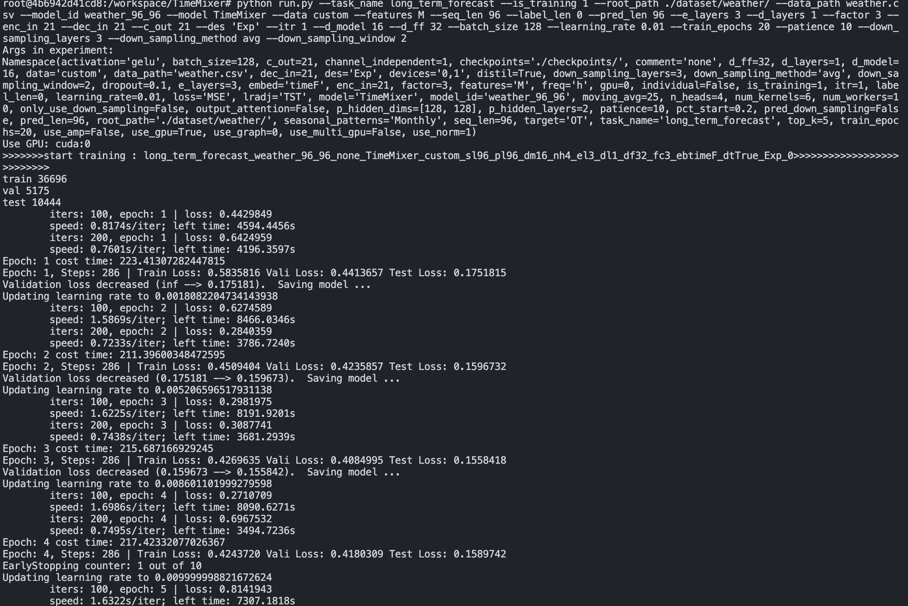

### 部分实验结果对比
对比MindSpore版本运行结果和原论文给出的Pytorch版本(baseline)运行结果，对比模型seq_len固定为96。使用的MSE和MAE指标都是越低预测效果越好，实验结果如下：


|Model|Weather|Solar-Energy|ETTh1|ETTh2|
|:-------|:-------:|:-------:|:-------:|:-------:|
||MSE MAE|MSE MAE|MSE MAE|MSE MAE|
|Baseline|0.163 0.209|0.189 0.259|0.375 0.400|0.289 0.341|
|MindSpore|0.156 0.207|0.199 0.287|0.376 0.402|0.290 0.342|

#### Weather
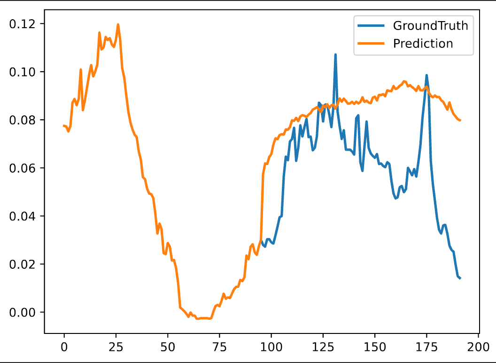

#### Solar-Energy
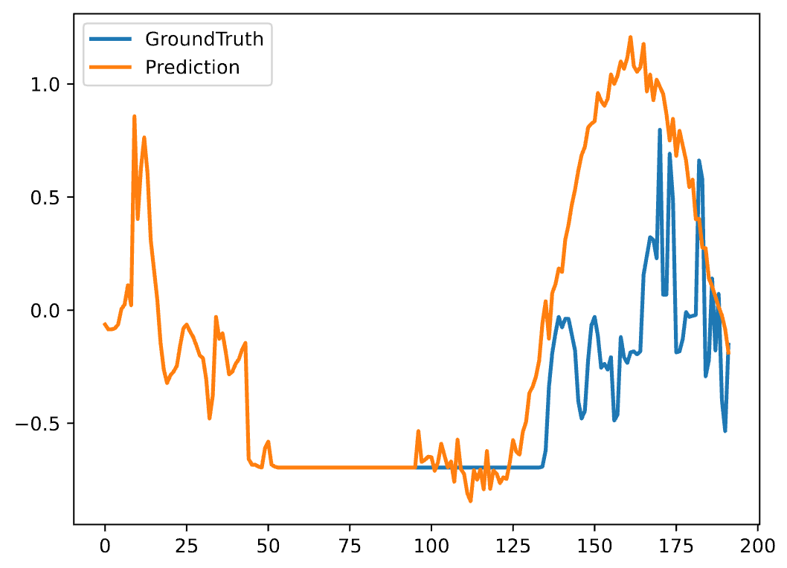

#### ETTh1
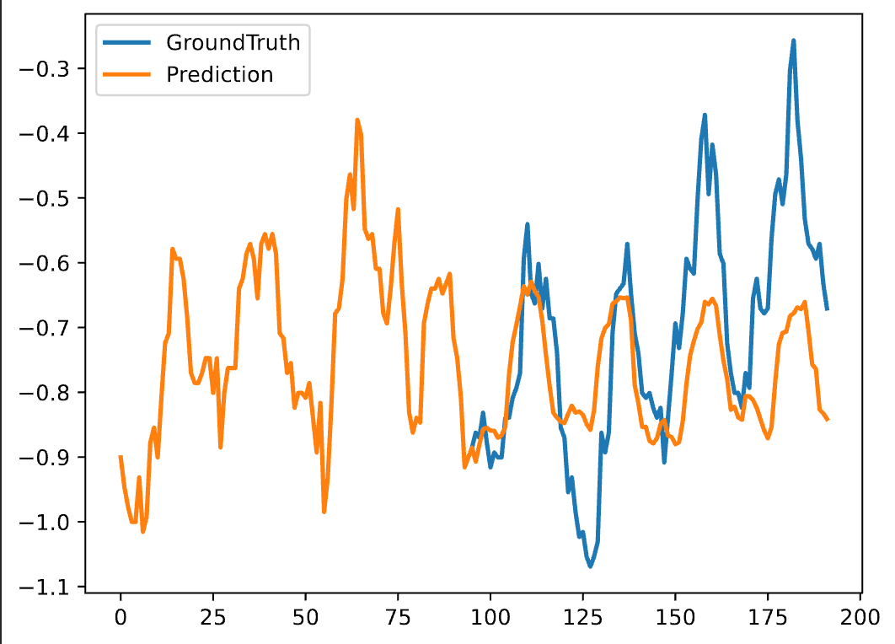

#### ETTh2
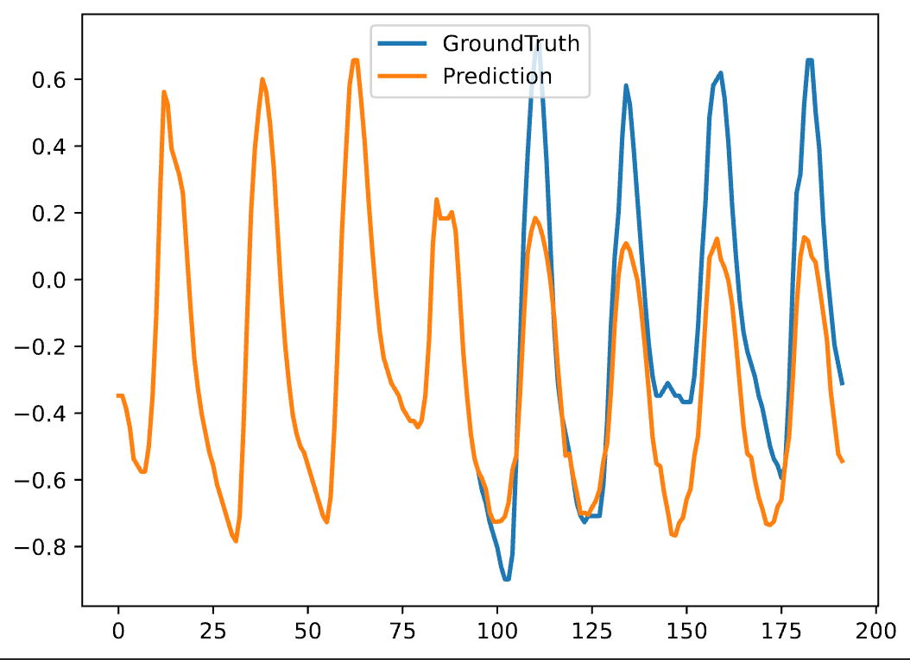